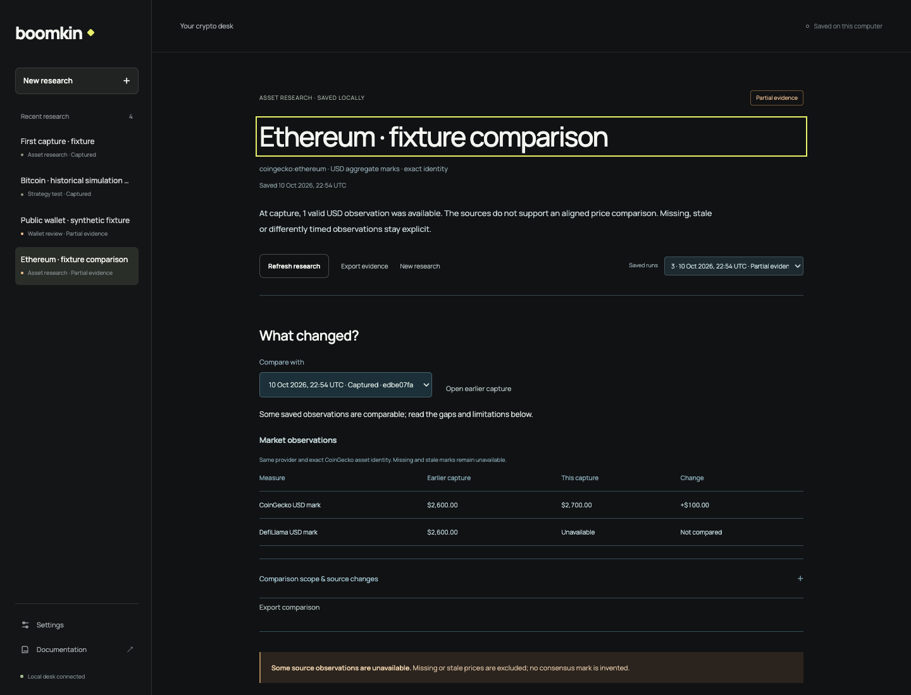
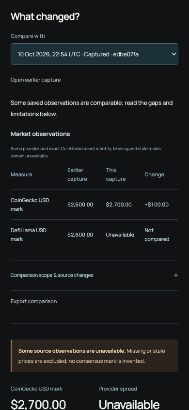

# Saved capture comparison: decision record

Research date: 2026-10-10. Baseline: `60fdb2f` on `galleonlabs/boomkin` main. No open pull requests or issues were listed at selection time. This is a draft implementation for Andrew's review; no deployment or runtime activation is part of this work.

## Product evidence and choice

Boomkin 0.11.0 already delivers three local public-data jobs, wallet accounting, frozen strategy validation, templates, exports and native Hermes follow-ups. PR #60 added the local desk. Reimplementing the wallet audit or another catalog/template expansion would duplicate recent work. The current desk retains independent captures but makes the human switch between whole reports to work out what changed. Its follow-up API also chooses the latest completed run even when the human is viewing an older run.

Selected upgrade: a saved-capture comparison with an explicit earlier baseline, a portable structured export, and native follow-ups tied to the displayed capture. It adds value to the existing refresh/history loop without requiring an account, paid API, new protocol adapter or scheduler. It preserves a small human interface and documents the exact machine contract.

Other opportunities considered: clickable evidence inspection would improve reading but does not answer the returning user's main question; automatic monitoring would add scheduling, provider and delivery authority beyond this task; broader asset/thesis intelligence would require new research sources and clear provider cost choices. These remain outside this PR.

## Current primary sources

- [Senpi](https://senpi.ai/) presents wallet-focused quant-desk jobs, trading scores and cost-leak investigation. Its public product surface supports a task-first interface, not copying its trading execution or marketing performance claims. Boomkin already has the wallet entry point; comparing subsequent captures is the missing continuation.
- [Elfa provenance](https://www.elfa.ai/provenance) describes timestamped, source-traceable market context. [Auto capabilities](https://docs.elfa.ai/auto/capabilities/) explicitly identifies state across evaluations, source freshness and replay/deduplication as part of monitoring. Inference for Boomkin: establish a reliable manual comparison contract before adding any monitoring integration. No Elfa service is connected in this change.
- [CoinGecko Simple Price](https://docs.coingecko.com/reference/simple-price) documents exact IDs and `include_last_updated_at` for checking freshness. A second HTTP capture can contain the same cached price observation. Comparison therefore matches provider and identity and checks source timestamps rather than interpreting retrieval time as a fresh price move.
- [Hyperliquid Info endpoint](https://hyperliquid.gitbook.io/hyperliquid-docs/for-developers/api/info-endpoint) documents at most 2,000 fills per time-query response and access to only the 10,000 most recent fills. It distinguishes spot and HIP-3 fills. A refresh of the same frozen historical window can change retained coverage; a changed activity subtotal is not portfolio profit earned since the last capture.
- The source-controlled [strategy engine provenance](../../site/vendor/provenance.json), [desk adapter](../../src/desk.ts) and [project evidence contract](../PROJECTS.md) are authoritative for the installed behavior. The worker inspected public helper files at the existing catalog's exact immutable revisions. No skills version, dependency contract or other repository is changed.

Competitor pages are first-party descriptions, not independent verification of their capabilities. The implementation decision rests on Boomkin's captured code behavior and the provider contracts above.

## Comparison boundaries

Comparisons use two completed public captures in the same project, oldest first, with unchanged saved inputs and helper revision. Each new derived result has a saved SHA-256 digest; existing captures remain readable and exportable, but captures from before that digest contract cannot produce numeric comparisons. Both source manifests, frozen briefs and derived result bytes must pass local consistency checks. These checks do not prove source truth or economic validity.

Market marks are matched by provider and exact identity. Missing/stale observations stay unavailable; cached or backward timestamps do not yield movement claims. Wallet decimals retain signed exact arithmetic and partial-coverage caveats. Wallet history totals compare the same requested window, whereas gross exposure describes sequential current-state reads. Strategy comparisons preserve period boundaries, frozen specification and data/engine hashes; shifted data or methodology withholds numeric deltas instead of implying an improvement in the rule.

The UI defaults to the nearest earlier completed capture and lets the user choose another. Source additions, missing artifacts and changed bytes are separate from economic change. There is no model call or external fetch in comparison. An explicit follow-up sends the selected run ID and preserves parent project/run identity; older API callers that omit a run ID retain latest-completed behavior.

## Validation plan

Use fixture captures to cover complete/partial data, signed decimals, cached/reversed timestamps, changed periods/hashes, missing legacy digests, changed sources/results, wrong run identity and exact-run follow-up provenance. Run repository-native typecheck/tests/build, static documentation checks, and desktop/mobile browser inspection against a disposable local fixture profile. An independent reviewer inspects the actual diff before a draft PR is created. Record actual results in the PR and the workspace delivery artifact.

## Review and rendered evidence (2026-10-11)

An independent agent reviewed the actual implementation diff and the exact pinned public helper contracts. It found two substantive issues: corrupt manifest shapes could throw instead of returning an unavailable comparison; the wallet helper's zero defaults for entirely failed history reads could become misleading deltas. Both were fixed with API and unit regressions. A follow-up review also corrected the unavailable-state source disclosure. Final independent review reported no remaining high-confidence findings, with 37 focused tests and 512 assertions passing, plus typecheck and whitespace checks. This is agent review evidence, not a GitHub approval.

Browser checks used a disposable loopback fixture profile, synthetic market/wallet responses and the already-vendored dated Bitcoin history. No model, credential, transaction or live market claim was involved. Verified desktop (1440px) and mobile (390px), all three comparison jobs, baseline switching, first-capture empty state, partial provider values, comparison export, retry after a simulated network error, and navigation while a comparison response was delayed. Mobile document width remained 390px and the comparison table fit its 346px content width, including the change column.

Full test/build/CI results are recorded in the draft PR. The shared Mac's measured load average exceeded 300 during validation; the default five-second test limit timed out unrelated baseline tests. Extended-timeout runs are reported explicitly rather than represented as a default-check pass. No runtime was activated or release deployed.
